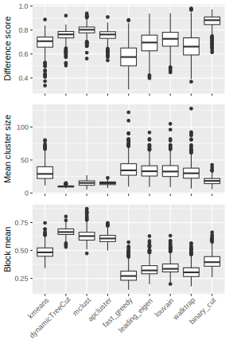

**Author**: Zuguang Gu ( z.gu@dkfz.de )

**Date**: `r Sys.Date()`

--------


```{r, echo = FALSE}
library(knitr)
knitr::opts_chunk$set(
    error = FALSE,
    tidy  = FALSE,
    message = FALSE,
    warning = FALSE,
    fig.align = "center")
```

## Introduction

Gene Ontology enrichment analysis is very frequently used in bioinformatics
field. In many cases, the results contain a very long list of significantly
enriched GO terms which has highly redundant information and difficult to
summarize. The GO enrichment results can be reduced by clustering GO terms
into groups where in the same group the GO terms are similar. The similarity
between GO terms is called **the semantic similarity** and can be calculated
by many software such as [**GOSemSim**
package](https://bioconductor.org/packages/release/bioc/html/GOSemSim.html).
The following figure is an example of the semantic similarity matrix from 500
randomly generated GO terms.

```{r, fig.width = 4, fig.height = 4, echo = FALSE}
library(simplifyGO)
library(circlize)
library(ComplexHeatmap)
set.seed(888)
go_id = random_GO(500)
mat = GO_similarity(go_id)
col_fun = colorRamp2(c(0, 1), c("white", "red"))
Heatmap(mat, name = "Similarity", col = col_fun,
	show_row_names = FALSE, show_column_names = FALSE,
	show_row_dend = FALSE, show_column_dend = FALSE,
	border = "#404040", column_title = "GO similarity matrix")
```

The GO similarity heatmap has a very special pattern that there are blocks
located on the diagonal. This is due to the structure of Directed Acyclic Graph (DAG)
for the Gene Ontologies.

Classifying GO terms into groups basically is to apply clustering on the GO simialrity matrix.
To solve this problem, there are two type of methods. 1. use methods that cluster a matrix. 2. treat
the similarity matrix as adjacency matrix and convert the matrix to a weighted network. Then 
apply network module/community methods.

There is one major problem for the clustering...

We proposed a method named "binary cut"... In the following similarity matrix which corresponds
to a subset of GO terms. Both are split by k-kmeans clustering with two groups. Mark the four 
partitions of the matrix as $s_{11}$, $s_{12}$, $s_{21}$ and $s_{22}$. 

```{r, fig.width = 6, fig.height = 3, echo = FALSE}
cl = binary_cut(mat)
tb = sort(table(cl), decreasing = TRUE)
ind1 = which(as.character(cl) %in% names(tb)[1])
ind2 = which(as.character(cl) %in% names(tb)[1:2])

mat1 = mat[ind1, ind1]
km = kmeans(mat1, centers = 2)$cluster
plot1 = grid.grabExpr({
	draw(Heatmap(mat1, name = "mat1", col = col_fun, show_row_dend = FALSE, show_column_dend = FALSE, 
		row_split = km, column_split = km,
		show_row_names = FALSE, show_column_names = FALSE,
		border = "#404040", row_title = NULL, column_title = "Similarity matrix 1",
		row_gap = unit(0, "mm"), column_gap = unit(0, "mm"), show_heatmap_legend = FALSE))
	decorate_heatmap_body("mat1", { ComplexHeatmap:::grid.text(gt_render("*s*<sub>11</sub>"), x = 0.5, y = 0.5, gp = gpar(fontfamily = "Times", fontsize = 20)) }, row_slice = 1, column_slice = 1)
	decorate_heatmap_body("mat1", { ComplexHeatmap:::grid.text(gt_render("*s*<sub>12</sub>"), x = 0.5, y = 0.5, gp = gpar(fontfamily = "Times", fontsize = 20)) }, row_slice = 1, column_slice = 2)
	decorate_heatmap_body("mat1", { ComplexHeatmap:::grid.text(gt_render("*s*<sub>21</sub>"), x = 0.5, y = 0.5, gp = gpar(fontfamily = "Times", fontsize = 20)) }, row_slice = 2, column_slice = 1)
	decorate_heatmap_body("mat1", { ComplexHeatmap:::grid.text(gt_render("*s*<sub>22</sub>"), x = 0.5, y = 0.5, gp = gpar(fontfamily = "Times", fontsize = 20)) }, row_slice = 2, column_slice = 2)
})
mat2 = mat[ind2, ind2]
km = kmeans(mat2, centers = 2)$cluster
plot2 = grid.grabExpr({
	draw(Heatmap(mat2, name = "mat1", col = col_fun, show_row_dend = FALSE, show_column_dend = FALSE, 
		row_split = km, column_split = km,
		show_row_names = FALSE, show_column_names = FALSE,
		border = "#404040", row_title = NULL, column_title = "Similarity matrix 2",
		row_gap = unit(0, "mm"), column_gap = unit(0, "mm"), show_heatmap_legend = FALSE))
	decorate_heatmap_body("mat1", { ComplexHeatmap:::grid.text(gt_render("*s*<sub>11</sub>"), x = 0.5, y = 0.5, gp = gpar(fontfamily = "Times", fontsize = 20)) }, row_slice = 1, column_slice = 1)
	decorate_heatmap_body("mat1", { ComplexHeatmap:::grid.text(gt_render("*s*<sub>12</sub>"), x = 0.5, y = 0.5, gp = gpar(fontfamily = "Times", fontsize = 20)) }, row_slice = 1, column_slice = 2)
	decorate_heatmap_body("mat1", { ComplexHeatmap:::grid.text(gt_render("*s*<sub>21</sub>"), x = 0.5, y = 0.5, gp = gpar(fontfamily = "Times", fontsize = 20)) }, row_slice = 2, column_slice = 1)
	decorate_heatmap_body("mat1", { ComplexHeatmap:::grid.text(gt_render("*s*<sub>22</sub>"), x = 0.5, y = 0.5, gp = gpar(fontfamily = "Times", fontsize = 20)) }, row_slice = 2, column_slice = 2)
})

grid.newpage()
pushViewport(viewport(x = 0, width = 0.5, just = "left"))
grid.draw(plot1)
popViewport()
pushViewport(viewport(x = 0.5, width = 0.5, just = "left"))
grid.draw(plot2)
popViewport()
```

The score $s$ is calcualted as:

$$s = \frac{s_{11} + s_{22}}{s_{11} + s_{12} + s_{21}, s_{22}}$$

Naturally, if $s$ is close to 0.5 (e.g. the left heatmap), all the terms are highly similar
and they should not be split any more, while if $s$ is close to 1, it means the group of GO terms
can still be split into two groups.

The algorithm is composed of two phases:

phase 1: clustering

1. for a similarity matrix, apply k-kmeans with two groups, calcualte $s$
2. for the two submatrix, apply step 1 recursively


phase 2: cut the dendrogram:

If the process are formatted as a dendrogram, the splitting can

1. split if the score of the node is larger than the cutoff
2. because the node more on the top have ... smaller scores, thus, if...

An example of splitting previous heatmap by binary cut is:

```{r, fig.width = 5, fig.height = 3, echo = FALSE}
cl = binary_cut(mat)
ht_GO_clusters(mat, cl, draw_word_cloud = FALSE)
```

Following plot compares ...


<p></p>

Once the GO terms are clustered, the ... can be summarized by word cloud.

```{r, fig.width = 8, fig.height = 4, echo = FALSE}
df = simplifyGO(mat, verbose = FALSE)
```

## Usage

**simplifyGO** starts with the GO similarity matrix. Users can use their own
similarity matrices or use the `GO_similarity()` function to calculate one. The
`GO_similarity()` function is simply a wrapper on `GOSemSim::mgoSim`. The
function accepts a vector of GO IDs. Note the GO should only belong to one
same ontology (i.e. `BP`, `CC` or `MF`).

In the following example, we sample 500 random GO IDs from GO biological process
(BP) ontology.

```{r}
set.seed(888)
go_id = random_GO(500)
mat = GO_similarity(go_id)
```

By default, `GO_similarity()` uses `Rel` method. Other method to calculate GO
similarities can be set by `measure` argument, e.g:

```{r, eval = FALSE}
GO_similarity(go_id, measure = "Wang")
```

With the similarity matrix `mat`, users can directly apply `simplifyGO()`
function to perform the clustering and visualize the results. The plot is the
same as the previous one, thus here we won't generate it again in the vignette.

```{r, fig.width = 8, fig.height = 5, eval = FALSE}
df = simplifyGO(mat)
```

In `simplifyGO()`, besides the default clustering method `binary_cut`, users
can also use other clustering methods. The supported methods are:

- `binary_cut`: This is the default clustering method and it runs `binary_cut()`.
- `kmeans`: It uses k-means clustering. The number of clusters are tried with
  `2:min(round(nrow(mat)/5), 100)`. The best number of k for k-means
  clustering is identified according to the "elbow" or "knee" method on the
  distribution of within-cluster sum of squares at each k.
- `dynamicTreeCut` It uses `dynamicTreeCut::cutreeDynamic()`.
- `mclust`: It uses `mclust::Mclust()`. The value of `G` in `mclust::Mclust()`
  is set to `1:min(round(nrow(mat)/5), 100)`.
- `apcluster`: It uses `apcluster::apcluster()`.
- `fast_greedy`: It treats the similarity matrix as an ajacency matrix and
  converts it to a graph/network where the similarity values are the weight of
  the edges of the graph, then the clustering on the similarity matrix is converted
  to looking for communities in the graph. This method applies `igraph::cluster_fast_greedy()` to detect
  communities in the graph.
- `leading_eigen`: It is a graph community detection method. It uses
  `igraph::cluster_leading_eigen()`.
- `louvain`: It is a graph community detection method. It uses
  `igraph::cluster_louvain()`.
- `walktrap`: It is a graph community detection method. It uses
  `igraph::cluster_walktrap()`.

On the right side of the heatmap are the word cloud annotations which summarize
the functions with keywords in every GO cluster. Following parameters control the generation
and graphic parameters of the word clouds:

- `draw_word_cloud`: Whether to draw the word clouds.
- `min_term`: Minimal number of GO terms in a cluster. All the clusters with
  size less than `min_term` are all merged into one single cluster in the
  heatmap.
- `order_by_size`: Whether to reorder GO clusters by their sizes. The cluster
  that is merged from small clusters (size < 5) is always put to the bottom of
  the heatmap.
- `exclude_words`: Words that are excluded in the word cloud.
- `max_words`: Maximal number of words visualized in the word cloud.
- `word_cloud_grob_param`: This controls the graphic parameters for the word
  clouds. The value should be a list and is passed to `word_cloud_grob()`
  function. There are following graphic parameters:
	* `line_space`: Space between lines. The value can be a `grid::unit`
	  object or a numeric scalar which is measured in mm.
	* `word_space`: Space between words. The value can be a `grid::unit`
	  object or a numeric scalar which is measured in mm.
	* `max_width`: The maximal width of the viewport to put the word cloud.
	  The value can be a `grid::unit` object or a numeric scalar which is
	  measured in mm. Note this might be larger than the final width of the
	  returned grob object.
	* `col`: Colors for the words. The value should be a self-defined function
	  that takes the number of words and font size as the two arguments. The
	  function should return a color vector.
- `fontsize_range`: The range of the font size. The value should be a numeric
  vector with length two. The minimal font size is mapped to word frequency
  value of 1 and the maximal font size is mapped to the maximal word
  frequency. The font size interlopation is linear.

Note there is no word cloud for the cluster that is merged from small clusters (size < 5).

The returned variable `df` is a data frame with GO IDs, GO term names and the
cluster labels:

```{r}
head(df)
```

The size of GO clusters can be retrieved by:

```{r}
sort(table(df$cluster))
```

`plot` argument can be set to `FALSE` in `simplifyGO()`, so that no plot is generated and only
the data frame is returned.

If the aim is only to cluster GO terms, `binary_cut()` function can be directly applied:

```{r}
binary_cut(mat)
```

## Benchmark

### On random datasets


The heatmap https://jokergoo.github.io/simplifyGO_figures/random_BP.html

<p></p>
<p></p>

### On real datasets

https://jokergoo.github.io/simplifyGO_figures/EBI_Expression_Atlas.html

<p></p>
<p></p>

## Session Info

```{r}
sessionInfo()
```
