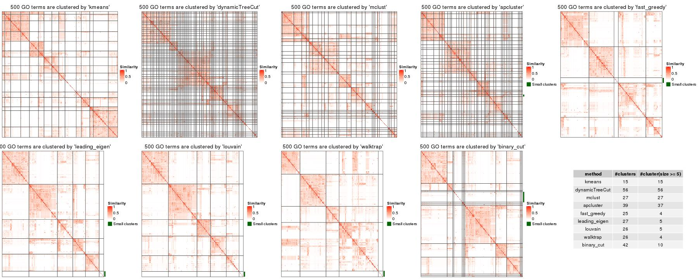

```{r, echo = FALSE}
library(knitr)
knitr::opts_chunk$set(
    error = FALSE,
    tidy  = FALSE,
    message = FALSE,
    warning = FALSE,
    fig.align = "center"
)
options(width = 100)
```

## Introduction

Gene Ontology enrichment analysis is very frequently used in bioinformatics
field. In many cases, the results contain a long list of significantly
enriched GO terms which has highly redundant information and is difficult to
summarize. The GO enrichment results can be reduced by clustering GO terms
into groups where in the same group the GO terms have similar information. The
similarity between GO terms is called **the semantic similarity** and can be
calculated by many software such as [the **GOSemSim**
package](https://bioconductor.org/packages/release/bioc/html/GOSemSim.html).
Figure 1 is an example of the semantic similarity matrix from 500 randomly
generated GO terms.

```{r, fig.width = 4, fig.height = 4, echo = FALSE, fig.cap = "Figure 1. A heatmap of the semantic similarity matrix from 500 random GO terms."}
library(simplifyEnrichment)
library(circlize)
library(ComplexHeatmap)
set.seed(888)
go_id = random_GO(500)
mat = GO_similarity(go_id)
col_fun = colorRamp2(c(0, 1), c("white", "red"))
Heatmap(mat, name = "Similarity", col = col_fun,
	show_row_names = FALSE, show_column_names = FALSE,
	show_row_dend = FALSE, show_column_dend = FALSE,
	border = "#404040", column_title = "GO similarity matrix")
```

The GO similarity heatmap has a very special pattern that there are blocks
located in the diagonal where GO terms in the same block share similar
functions. This is due to the structure of the GO relationship which is in a
form of the Directed Acyclic Graph (DAG) where terms in a same branch of the
graph tends to be more similar (More to the leaves of the graph, the similarity
is stronger).

Classifying GO terms into groups basically is a task of clustering on the GO
simialrity matrix. To solve this problem, there are two type of methods: 1.
the clustering methods that directly apply to a matrix, _e.g._, _k_-means
clustering, and 2. treating the similarity matrix as an adjacency matrix and
converting the matrix to a weighted graph/network, then graph community/module
detection methods are applied to partition the graph.

There are two major problems for clustering GO terms which can also be
observed from Figure 1. First, the sizes of the GO clusters vary a lot, which
means, there are very large clusters, and at the same time, there are also
many tiny clusters. Large clusters tend to have relative lower mean
similarities across terms while small clusters have relative higher mean
similarity values. Methods such as _k_-means will further split the large
cluster into small clusters, which might produce redundancy information among
these small clusters that are split from the large clusters. 2. GO terms in
the large clusters are more likely to share similarities to the terms in other
large clusters, which results in that, for some graph community detection
methods, these large clusters sharing terms are merged into an even larger
cluster. The two problems can be simplified as 1. large clusters are split
into more small clusters and 2. large clusters are merged into larger
clusters. Thus, we need to find a effective method to balance these two
scenarios.

Here we proposed a new clustering method called "**binary cut**" to spit GO
terms into groups. The idea behind is very simple and staightforward which is
to identify "the blocks" in the similarity heatmap. As shown in Figure 2, the
two heatmaps are both similarity matrices for two subsets of GO terms.

```{r, fig.width = 6, fig.height = 3.5, echo = FALSE, out.width = "50%", fig.cap = "Figure 2. Two similarity matrices that correspond to two subsets of GO terms."}
cl = binary_cut(mat)
tb = sort(table(cl), decreasing = TRUE)
ind1 = which(as.character(cl) %in% names(tb)[1])
ind2 = which(as.character(cl) %in% names(tb)[1:2])

mat1 = mat[ind1, ind1]
km = kmeans(mat1, centers = 2)$cluster
plot1 = grid.grabExpr({
	draw(Heatmap(mat1, name = "mat1", col = col_fun, show_row_dend = FALSE, show_column_dend = FALSE, 
		row_split = km, column_split = km,
		show_row_names = FALSE, show_column_names = FALSE,
		border = "#404040", row_title = NULL, 
		column_title = gt_render("Similarity sub-matrix *M*<sub>*a*</sub>"),
		row_gap = unit(0, "mm"), column_gap = unit(0, "mm"), show_heatmap_legend = FALSE))
	decorate_heatmap_body("mat1", { ComplexHeatmap:::grid.text(gt_render("*s*<sub>11</sub>"), x = 0.5, y = 0.5, gp = gpar(fontfamily = "Times", fontsize = 20)) }, row_slice = 1, column_slice = 1)
	decorate_heatmap_body("mat1", { ComplexHeatmap:::grid.text(gt_render("*s*<sub>12</sub>"), x = 0.5, y = 0.5, gp = gpar(fontfamily = "Times", fontsize = 20)) }, row_slice = 1, column_slice = 2)
	decorate_heatmap_body("mat1", { ComplexHeatmap:::grid.text(gt_render("*s*<sub>21</sub>"), x = 0.5, y = 0.5, gp = gpar(fontfamily = "Times", fontsize = 20)) }, row_slice = 2, column_slice = 1)
	decorate_heatmap_body("mat1", { ComplexHeatmap:::grid.text(gt_render("*s*<sub>22</sub>"), x = 0.5, y = 0.5, gp = gpar(fontfamily = "Times", fontsize = 20)) }, row_slice = 2, column_slice = 2)
})
mat2 = mat[ind2, ind2]
km = kmeans(mat2, centers = 2)$cluster
plot2 = grid.grabExpr({
	draw(Heatmap(mat2, name = "mat2", col = col_fun, show_row_dend = FALSE, show_column_dend = FALSE, 
		row_split = km, column_split = km,
		show_row_names = FALSE, show_column_names = FALSE,
		border = "#404040", row_title = NULL, 
		column_title = gt_render("Similarity sub-matrix *M*<sub>*b*</sub>"),
		row_gap = unit(0, "mm"), column_gap = unit(0, "mm"), show_heatmap_legend = FALSE))
	decorate_heatmap_body("mat2", { ComplexHeatmap:::grid.text(gt_render("*s*<sub>11</sub>"), x = 0.5, y = 0.5, gp = gpar(fontfamily = "Times", fontsize = 20)) }, row_slice = 1, column_slice = 1)
	decorate_heatmap_body("mat2", { ComplexHeatmap:::grid.text(gt_render("*s*<sub>12</sub>"), x = 0.5, y = 0.5, gp = gpar(fontfamily = "Times", fontsize = 20)) }, row_slice = 1, column_slice = 2)
	decorate_heatmap_body("mat2", { ComplexHeatmap:::grid.text(gt_render("*s*<sub>21</sub>"), x = 0.5, y = 0.5, gp = gpar(fontfamily = "Times", fontsize = 20)) }, row_slice = 2, column_slice = 1)
	decorate_heatmap_body("mat2", { ComplexHeatmap:::grid.text(gt_render("*s*<sub>22</sub>"), x = 0.5, y = 0.5, gp = gpar(fontfamily = "Times", fontsize = 20)) }, row_slice = 2, column_slice = 2)
})

grid.newpage()
pushViewport(viewport(x = 0, width = 0.5, just = "left"))
grid.draw(plot1)
popViewport()
pushViewport(viewport(x = 0.5, width = 0.5, just = "left"))
grid.draw(plot2)
popViewport()
```

Let's denote the two matrices as $M_a$ (the left matrix) and $M_b$ (the right
matrix). Intuitively, terms in $M_a$ all have high pairwise similarity and
thus should be treated as one single cluster and should not be split any more,
while terms in $M_b$ still show two-block pattern and should be further split
into two more groups. To measure whether a certain subset of GO terms need to
be split, we calculate a score denoted as $s$ as follows:

For a similarity atrix which corresponds to a subset of GO terms, _e.g._,
$M_a$ or $M_b$, _k_-means clustering with two groups is applied on rows and
columns and partitions the matrix into four parts, as illustrated in Figure 2.
Denote the score for the four partitions as $s_{11}$, $s_{12}$, $s_{21}$ and
$s_{22}$, where _e.g._, $s_{11}$ is the median value of the corresponding
sub-matrix, the score $s$ is calculated as:

$$s = \frac{s_{11} + s_{22}}{s_{11} + s_{12} + s_{21} + s_{22}}$$

Naturally, if $s$ is close to 0.5 (_e.g._, the left heatmap), all terms are
highly similar and they should not be split any more, while if $s$ is close to
1, it means the GO terms can still be split into more groups.

The "binary cut" algorithm is composed of two phases:

**phase 1: applies divisive clustering (the top-down approach) and generates a
dendrogram.**

1. for a similarity matrix from a set of GO terms, apply _k_-means clustering
   with two groups, calculate the score $s$ and store ot on the current
   node in the dendrogram.
2. for the two subsets of GO terms partitioned by the _k_-means clustering,
   apply step 1 to the two corresponding similarity sub-matrices separatedly.

The clustering in step 1 and 2 are executed recursively untile the number of
GO terms in a group reaches 1 which are treated as the leaves of the
dendrogram.

**phase 2: cuts the dendrogram and generates partitions.** Since every node in
the dendrogram has a score $s$ attached, we simply test $s$ to a cutoff (0.85
as the default). If $s$ is larger than the cutoff, the two branches from the
node is split, or else all the terms under the node are taken as one single
cluster.

Nodes with large number of terms tend to have relatively smaller $s$, thus, it
is possible at a certain node, $s$ does not exceed the cutoff (very close to
it), while its child nodes have $s$ larger than the cutoff. In this case, we
don't want to close the clusters so early and we still split this node into
two sub=groups so that its child nodes can be split further more. To overcome
this, the rule in phase 2 are modified as: if a node does not exceed the
cutoff, but if at least one of its child nodes exceed the cutoff, the node is
still split.

Examples of the step-wise clustering are illustrated in Figure 3 (the first 4
iterations):

```{r, fig.width = 20, fig.height = 4, echo = FALSE, fig.cap = "Figure 3. Process of binary clustering the similarity matrix. In the plot only the first 4 iterations are shown."}
dend = simplifyEnrichment:::cluster_mat(mat)
p1 = grid.grabExpr(simplifyEnrichment:::plot_binary_cut(mat, dend = dend, depth = 1, show_heatmap_legend = FALSE))
p2 = grid.grabExpr(simplifyEnrichment:::plot_binary_cut(mat, dend = dend, depth = 2, show_heatmap_legend = FALSE))
p3 = grid.grabExpr(simplifyEnrichment:::plot_binary_cut(mat, dend = dend, depth = 3, show_heatmap_legend = FALSE))
p4 = grid.grabExpr(simplifyEnrichment:::plot_binary_cut(mat, dend = dend, depth = 4, show_heatmap_legend = FALSE))
library(cowplot)
plot_grid(p1, p2, p3, p4, nrow = 1)
```

Figure 4 illustrates the complete dendrogram and the partitions in the
heatmap. In the dendrogram, for each node, the score corresponds to the color
of the edge connected to the top of the node. The edges in grey connect the
leaves of the dendrogram. The nodes marked with cross lines are the nodes that
need to be split under the default cutoff (0.85).

```{r, fig.width = 6, fig.height = 4, echo = FALSE, fig.cap = "Figure 4. Partition GO terms by splitting the dendrogram."}
simplifyEnrichment:::plot_binary_cut(mat, dend = dend)
```

In Figure 4 we can see there are a lot of tiny clusters that they can actually
be put into a separated group. Figure 5 is an improved visualization where
clusters with size less than 5 are put into a separated group marked by a
green line and moved to the bottom right of the heatmap. This makes the plot
looks more clean.

```{r, fig.width = 5, fig.height = 4, echo = FALSE, fig.cap = "Figure 5. An improved visualization on the clustering of GO terms."}
cl = simplifyEnrichment:::cut_dend(dend)
ht_clusters(mat, cl, draw_word_cloud = FALSE)
```

Once the GO terms are clustered into groups, the functions of the terms in
each group can be summarized by word clouds of keywords, illustrated in Figure
6.

```{r, fig.width = 8, fig.height = 5, echo = FALSE, fig.cap = "Figure 6. A clustering of GO terms with word clouds as the annotations."}
df = simplifyGO(mat, verbose = FALSE)
```

## Usage

**simplifyGO** starts with the GO similarity matrix. Users can use their own
similarity matrices or use the `GO_similarity()` function to calculate one. The
`GO_similarity()` function is simply a wrapper on `GOSemSim::mgoSim`. The
function accepts a vector of GO IDs. Note the GO should only belong to one
same ontology (_i.e._, `BP`, `CC` or `MF`).

In the following example, we sample 500 random GO IDs from GO Biological Process
(BP) ontology.

```{r}
set.seed(888)
go_id = random_GO(500)
mat = GO_similarity(go_id)
```

By default, `GO_similarity()` uses `Rel` method in `GOSemSim::mgoSim`. Other
methods to calculate GO similarities can be set by `measure` argument, _e.g._:

```{r, eval = FALSE}
GO_similarity(go_id, measure = "Wang")
```

With the similarity matrix `mat`, users can directly apply `simplifyGO()`
function to perform the clustering as well as visualizing the results. The
plot is the same as Figure 6, thus here we won't generate it again in the
vignette.

```{r, fig.width = 8, fig.height = 5, eval = FALSE}
df = simplifyGO(mat)
```

In `simplifyGO()`, besides the default clustering method `binary_cut`, users
can also use other clustering methods. The supported methods are:

- `binary_cut`: This is the default clustering method and it runs
  `binary_cut()`.
- `kmeans`: It uses _k_-means clustering. The number of clusters are tried with
  `2:min(round(nrow(mat)/5), 100)`. The best number of _k_ for _k_-means
  clustering is identified according to the "elbow" or "knee" method on the
  distribution of within-cluster sum of squares at each _k_.
- `dynamicTreeCut` It uses `dynamicTreeCut::cutreeDynamic()`.
- `mclust`: It uses `mclust::Mclust()`. The value of `G` in `mclust::Mclust()`
  is set to `1:min(round(nrow(mat)/5), 100)`.
- `apcluster`: It uses `apcluster::apcluster()`.
- `fast_greedy`: It treats the similarity matrix as an ajacency matrix and
  converts it to a graph where the similarity values are the weight of
  the edges in the graph. Then the clustering on the similarity matrix is
  converted to looking for communities in the graph. This method applies
  `igraph::cluster_fast_greedy()` to detect communities in the graph.
- `leading_eigen`: It is a graph community detection method. It uses
  `igraph::cluster_leading_eigen()`.
- `louvain`: It is a graph community detection method. It uses
  `igraph::cluster_louvain()`.
- `walktrap`: It is a graph community detection method. It uses
  `igraph::cluster_walktrap()`.

**Please note, all other methods are mainly for comparing to the `binary_cut`
method. They are not recommended to use.**

On the right side of the heatmap are the word cloud annotations which
summarize the functions with keywords in every GO cluster. Following
parameters control the generation and graphic parameters of the word clouds:

- `draw_word_cloud`: Whether to draw the word clouds.
- `min_term`: Minimal number of GO terms in a cluster. All the clusters with
  size less than `min_term` are all merged into one single cluster in the
  heatmap.
- `order_by_size`: Whether to reorder GO clusters by their sizes. The cluster
  that is merged from small clusters (size < 5) is always put to the bottom right of
  the heatmap.
- `exclude_words`: Words that are excluded in the word cloud. _E.g._, in
  previous example, the word "regulation" and "process" can be excluded
  because they have very high frequency in the word clouds but are not very
  helpful for interpreting the results.
- `max_words`: Maximal number of words visualized in the word cloud, _i.e._, 
   the top words with the highest frequency.
- `word_cloud_grob_param`: This controls the graphic parameters for the word
  clouds. The value should be a list and is passed to `word_cloud_grob()`
  function. There are following graphic parameters:
	* `line_space`: Space between lines. The value can be a `grid::unit`
	  object or a numeric scalar which is measured in mm.
	* `word_space`: Space between words. The value can be a `grid::unit`
	  object or a numeric scalar which is measured in mm.
	* `max_width`: The maximal width of the viewport to put the word cloud.
	  The value can be a `grid::unit` object or a numeric scalar which is
	  measured in mm. Note this might be larger than the final width of the
	  returned grob object.
	* `col`: Colors for the words. The value should be a self-defined function
	  that takes the number of words and font size as the two arguments. The
	  function should return a color vector. By default it uses random colors.
- `fontsize_range`: The range of the font size. The value should be a numeric
  vector with length two. The minimal font size is mapped to word frequency
  value of 1 and the maximal font size is mapped to the maximal word
  frequency. The font size interlopation is linear.

Note there is no word cloud for the cluster that is merged from small clusters
(size < 5).

The returned variable `df` is a data frame with GO IDs, GO term names and the
cluster labels:

```{r}
head(df)
```

The size of GO clusters can be retrieved by:

```{r}
sort(table(df$cluster))
```

`plot` argument can be set to `FALSE` in `simplifyGO()`, so that no plot is
generated and only the data frame is returned.

If the aim is only to cluster GO terms, `binary_cut()` function can be
directly applied:

```{r}
binary_cut(mat)
```

## Benchmark

We compare the following clustering methods to binary cut: `kmeans`,
`dynamicTreeCut`, `mclust`, `apcluster`, `fast_greedy`, `leading_eigen`,
`louvain` and `walktrap`. The actual R functions used to perform corresponding
analysis can be found in text in previous sections in this vignette.

### On random datasets

500 random GO terms are generated from Biology Process ontology. One example
of the clustering from different methods are illustrated in Figure 7. Basically we can see
`kmeans`, `dynamicTreeCut`, `mclust` and `apcluster` generate too many small
clusters and cannot split tiny cluster. `fast_greedy`, `leading_eigen`,
`louvain` and `walktrap` can identify both small and large clusters, however, some
large clusters are too ...

```{r, echo = FALSE, fig.cap = "Figure 7. Compare clustering from different methods. Tiny clusters (size < 5) are merged into a separated cluster marked by a green line."}

```

The random GO terms were generated 100 times and we compared following metrics:

1. the different between the similarity values for the terms that belong to
   the same clusters and in different clusters. The difference score is the
   Kolmogorov-Smirnov statistic between the two distributions.
2. Number of clusters. For each there are two numbers: the number of all
   clusters and the number of clusters with size >= 5
3. the mean similarity values of the blocks in the similarity heatmap, which is the mean similarity
   for the terms in the same clusters.

In Figure 8, we can see binary cut has the highest difference score, which means, in the 
clustering by binary cut, the terms in the same clusters shows the most distinct distribution
to the rest of values in the similarity matrix.

Next we calculate the similarity between clustering methods. For the partitions
from two methods, first adjust the labels...

Then the concordance of the two partitions is calculated as:


```{r, echo = FALSE, fig.width = 10, fig.height = 5, fig.cap = "Figure 8. Compare metrics for different clustering methods, on randomly generated datasets."}
lt = readRDS("random_BP_results.rds")
diff_score_df = lt$diff_score_df
cluster_number_df = lt$cluster_number_df
cluster_number2_df = lt$cluster_number2_df
block_mean_df = lt$block_mean_df
arr = lt$arr

library(ggplot2)
library(grid)
p1 = ggplot(diff_score_df, aes(x = method, y = value)) +
	geom_boxplot() + ylab("Difference score") +
	theme(axis.title.x = element_blank(), axis.text.x = element_blank())

cluster_number_df$type = "All sizes"
cluster_number2_df$type = "size >= 5"
p2 = ggplot(rbind(cluster_number_df, cluster_number2_df), aes(x = method, y = value, col = type)) +
	geom_boxplot() + ylab("cluster number") +
	theme(axis.title.x = element_blank(), axis.text.x = element_blank())

p3 = ggplot(block_mean_df, aes(x = method, y = value)) +
	geom_boxplot() + ylab("Block mean") +
	theme(axis.title.x = element_blank(), axis.text.x = element_text(angle = 45, hjust = 1))

library(cowplot)
m_mean = apply(arr, 1:2, mean)
p4 = grid.grabExpr(draw(Heatmap(m_mean, name = "concordance", column_names_rot = 45)))

plot_grid(plot_grid(p1, p2, p3, nrow = 3, align = "v", axis = "lr", rel_heights = c(1, 1, 1.5)),
	p4, nrow = 1)
```

The heatmaps for the 100 runs of clustering random GO terms can be found at https://jokergoo.github.io/simplifyGO_figures/random_BP.html.


### On real datasets

We downloaded the datasets from [EBI Expression
Atlas](https://www.ebi.ac.uk/gxa/download). We applied
[**clusterProfiler**](https://bioconductor.org/packages/release/bioc/html/clusterProfiler.html)
to the significantly expressed genes (FDR < 0.05, number in [500, 3000]) only
with the GO Biological Process ontology. And we only took the datasets with
significant GO terms in [100, 1000].


The heatmaps can be found at https://jokergoo.github.io/simplifyGO_figures/EBI_Expression_Atlas.html.

```{r, echo = FALSE, fig.width = 10, fig.height = 5, fig.cap = "Figure 9. Compare metrics for different clustering methods, on real-world datasets."}
lt = readRDS("EBI_Expression_Atlas_results.rds")
diff_score_df = lt$diff_score_df
cluster_number_df = lt$cluster_number_df
cluster_number2_df = lt$cluster_number2_df
block_mean_df = lt$block_mean_df
arr = lt$arr

library(ggplot2)
library(grid)
p1 = ggplot(diff_score_df, aes(x = method, y = value)) +
	geom_boxplot() + ylab("Difference score") +
	theme(axis.title.x = element_blank(), axis.text.x = element_blank())

cluster_number_df$type = "All sizes"
cluster_number2_df$type = "size >= 5"
p2 = ggplot(rbind(cluster_number_df, cluster_number2_df), aes(x = method, y = value, col = type)) +
	geom_boxplot() + ylab("cluster number") +
	theme(axis.title.x = element_blank(), axis.text.x = element_blank())

p3 = ggplot(block_mean_df, aes(x = method, y = value)) +
	geom_boxplot() + ylab("Block mean") +
	theme(axis.title.x = element_blank(), axis.text.x = element_text(angle = 45, hjust = 1))

m_mean = apply(arr, 1:2, mean)
p4 = grid.grabExpr(draw(Heatmap(m_mean, name = "concordance", column_names_rot = 45)))

plot_grid(plot_grid(p1, p2, p3, nrow = 3, align = "v", axis = "lr", rel_heights = c(1, 1, 1.5)),
	p4, nrow = 1)
```


### Utility functions for comparing clustering methods

In the **simplifyEnrichment** package, there are also functions that compare
clustering results from different methods. Here we still use previously
generated variable `mat` which is the similarity matrix from the 500 random GO
terms. Simply running `compare_methods()` performs all the supported methods (encoded in `simplifyEnrichment:::ALL_CLUSTERING_METHODS`) excluding `mclust`, since `mclust` usually
takes very long time to run. The function generates a figure with three panels:

1. A heatmap of the similarity matrix with different classifications as row
   annotations.
2. A heatmap of the pair-wise concordance of the classifications of every two
   clustering methods.
3. Barplots of the difference scores for each method (calculated by
   `difference_score`), the number of clusters (all clusters and the clusters
   with size >= 5) and the mean similarity in the terms that are in the same
   cluster.


```{r, fig.width = 10, fig.height = 7}
compare_methods(mat)
```

If `plot_type` argument is set to `heatmap`. There are heatmaps for the
similarity matrix under clusterings from different methods. The last panel is
a table with the number of clusters under different clusterings.

```{r, eval = FALSE}
# The following code may take long time to run (several minutes)
compare_methods(mat, plot_type = "heatmap")
```

Please note, the clustering methods might have randomness:

```{r, eval = FALSE}
set.seed(123)
compare_methods(mat)
set.seed(123)
compare_methods(mat, plot_type = "heatmap")
```

`compare_methods()` is simply a wrapper on `compare_methods_make_clusters()` and `compare_methods_make_plot()`
where the former function performs clustering with different methods and the latter visualizes the results.
They can ..

```{r, eval = FALSE}
clt = compare_methods_make_clusters(mat)
compare_methods_make_plot(mat, clt)
compare_methods_make_plot(mat, clt, plot_type = "heatmap")
```


## Session Info

```{r}
sessionInfo()
```
